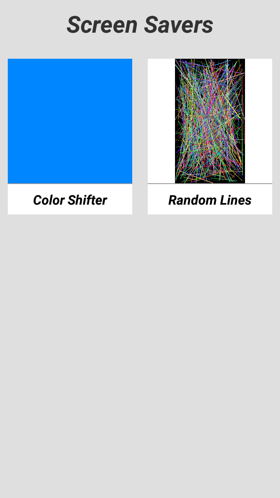
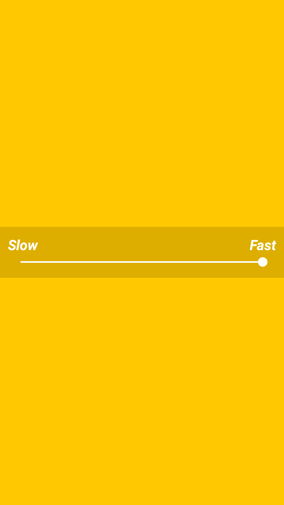
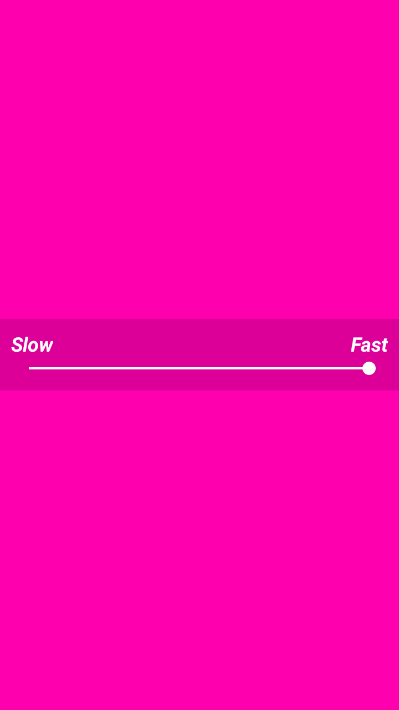
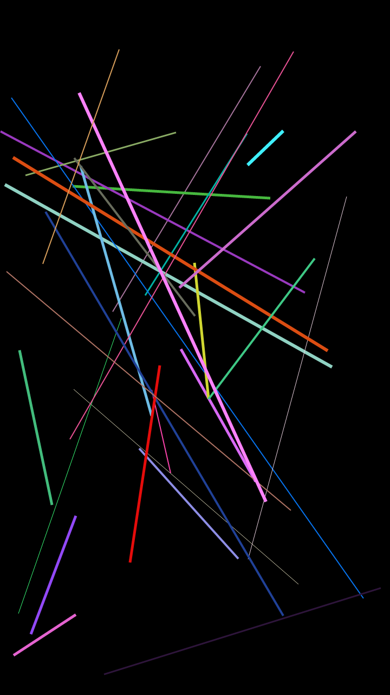
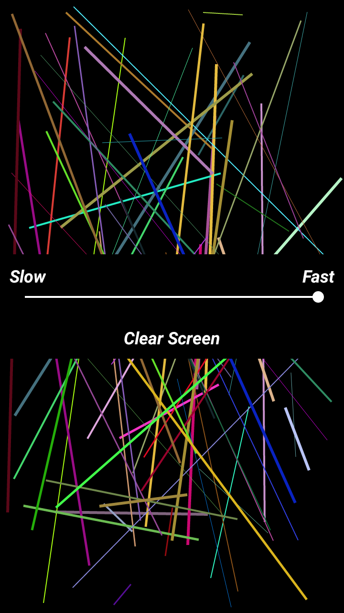
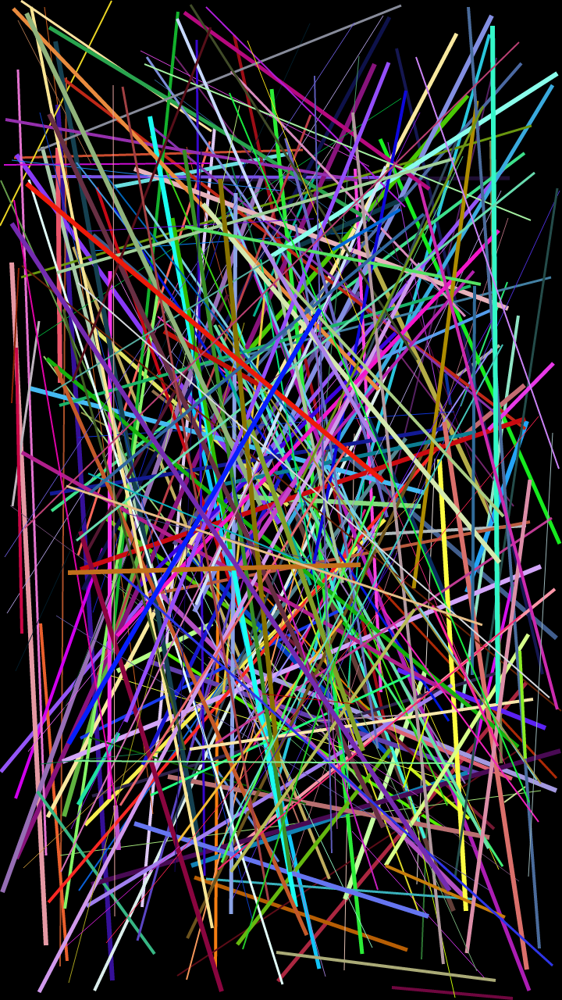

# Screen Savers

<table>
    <tr>
        <th>Title</th>
        <td> Screen Savers </td>
    </tr>
    <tr>
        <th>Short description</th>
        <td>Enjoy colorful, beautiful and amazing screensavers.</td>
    </tr>
    <tr>
        <th>Full description</th>
        <td>Beautiful and colorful screensavers at your finger tips.

There are various screensavers for you to try.

You can customize the screensavers to your preference.
You can:
- Change the speed
- Change the color
- Change size of the elements

More Screensavers are under development.

This is an opensource application. You can find its source code at:
https://github.com/kashew-developers/ScreenSavers</td>
    </tr>
</table>

----

#### Screenshots

<table>
    <tr>
        <td></td>
        <td></td>
        <td></td>
    </tr>
    <tr>
        <td></td>
        <td></td>
        <td></td>
    </tr>
</table>
